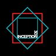

<div align="center">
  

  <h1>INCEPTION 3D</h1>

  <p><strong>Plataforma interna de Impressão 3D e Modelagem</strong></p>
  <p>Gestão de projetos, arquivos, cursos, solicitações e usuários — tudo em um só lugar.</p>

  <p>
    
    
    
    
    
  </p>
</div>

---

## Sumário

- [Sobre o projeto](#-sobre-o-projeto)
- [Stack](#-stack)
- [Funcionalidades](#-funcionalidades)
- [Como rodar](#-como-rodar)
- [Contas de demonstração](#-contas-de-demonstração)
- [Mapa de rotas](#-mapa-de-rotas)
- [Estrutura de pastas](#-estrutura-de-pastas)
- [Identidade visual](#-identidade-visual)
- [Scripts disponíveis](#-scripts-disponíveis)
- [Próximos passos](#-próximos-passos)

---

## Sobre o projeto

O **Inception 3D** é uma plataforma web pensada para uma operação interna de impressão 3D e modelagem. Centraliza o ciclo de vida dos projetos: desde a **solicitação** feita por um cliente, passando pelo **acompanhamento por setor**, **gestão de arquivos** (.stl, .obj, .3mf, .step, .gcode), **catálogo de cursos** para a equipe e **administração de usuários** com diferentes níveis de permissão.

A interface foi desenhada em modo escuro com a marca da empresa, priorizando clareza nas listas, formulários objetivos e estados visuais nítidos para status, etapas e progresso.

> Este repositório entrega um **front-end completo e navegável** com dados de demonstração em memória (mocks). A camada de back-end está desacoplada — basta plugar uma API real onde hoje os mocks servem os dados.

---

## Stack

| Camada | Tecnologias |
|---|---|
| Linguagens | HTML, CSS, **TypeScript** |
| Runtime | **Node.js 22** |
| Front-end | **React 18** + React Router DOM 6 |
| Build / Dev | **Vite 5** |
| UI | CSS puro com tokens de design (sem framework de UI), ícones [Lucide](https://lucide.dev) |
| Tipografia | Inter + JetBrains Mono (Google Fonts) |
| Estado / Auth | React Context + `localStorage` |

---

## Funcionalidades

### Autenticação
- Login com validação real de e-mail/senha
- Sessão persistida em `localStorage`
- Rotas internas protegidas (redirecionamento para `/login`)
- Permissões por *role* (Super Admin, Admin, Usuário, Visitante)
- Painel de contas de demonstração com preenchimento automático

### Painel (Dashboard)
- Saudação personalizada com o primeiro nome do usuário
- Cards de KPIs: **Em Andamento**, **Concluídos**, **Pausados**
- Lista "Seus projetos e do seu setor" filtrada dinamicamente pelo setor de quem está logado
- Linha do tempo de **Atividade Recente**

### Projetos
- Listagem com **busca** por título/responsável e **filtro por setor** (Projetos, Ensino, Tesouraria, Marketing, RH)
- Cards com responsável, etapa atual, data de atualização e barra de progresso temática
- Página de detalhe com:
  - Pipeline de aprovação (Solicitado → Em Análise → Em Andamento → Concluído)
  - Listagem de arquivos vinculados ao projeto
  - Histórico de alterações
  - Ações de **Editar** / **Excluir**

### Arquivos
- Visão de **pastas** organizadas por setor com contagem e data
- Modal de **Nova Pasta** (título, categoria, descrição)
- Página interna da pasta com listagem de arquivos 3D (extensão, tamanho, data, ações de download/excluir)
- Modal de **Upload** disponível **apenas dentro das pastas** (UX intencional)

### Cursos
- Catálogo com **filtros duplos**: categoria (Modelagem, Impressão, Design, Administrativo) e setor
- Cards com tags por nível, duração e barra de progresso
- FAB (Floating Action Button) para adicionar novo curso

### Solicitações
- Tabs **Todas / Pendentes / Aprovadas / Rejeitadas**
- Cards de solicitação com contato, descrição e ações de **Aprovar / Rejeitar** quando pendente
- Formulário **Nova Solicitação** com pipeline lateral mostrando o estágio inicial

### Perfil
- Dados reais do usuário logado (nome, e-mail, cargo, setor, avatar)
- Edição de campos básicos
- Tags coloridas indicando *role*

### Usuários *(Super Admin / Admin)*
- Tabela completa com avatar, perfil colorido, setor, status (Ativo/Inativo), data de cadastro
- Filtros por *role* e setor + busca por nome/e-mail
- Item oculto na sidebar para perfis sem permissão

---

## Como rodar

### Pré-requisitos
- [Node.js 18+](https://nodejs.org) (desenvolvido em Node 22)
- npm 9+

### Instalação

```bash
git clone <url-do-repositorio>
cd "Oficina Projeto"
npm install
```

### Modo desenvolvimento

```bash
npm run dev
```

Aplicação disponível em `http://localhost:5173` (a porta sobe se 5173 estiver ocupada).

### Build de produção

```bash
npm run build
npm run preview
```

---

## Contas de demonstração

A tela de login traz um painel expansível **"Contas de demonstração"** que preenche automaticamente os campos ao clicar. Para referência:

| E-mail | Senha | Perfil | Setor | Status |
|---|---|---|---|---|
| `carlos.santos@inception3d.com` | `carlos123` | **Super Admin** | Projetos | Ativo |
| `maria.costa@inception3d.com` | `maria123` | **Admin** | Tesouraria | Ativo |
| `roberto.silva@inception3d.com` | `roberto123` | Usuário | Marketing | Ativo |
| `ana.silva@inception3d.com` | `ana123` | Usuário | Projetos | Ativo |
| `pedro.visitante@external.com` | `pedro123` | Visitante | Ensino | **Inativo** |

> A conta inativa é rejeitada no login com a mensagem *"Esta conta está inativa"*.
>
> Apenas **Super Admin** e **Admin** veem o item **Usuários** na barra lateral e conseguem acessar `/usuarios`.

---

## Mapa de rotas

| URL | Tela | Acesso |
|---|---|---|
| `/login` | Tela de login | Público |
| `/` | Painel (Dashboard) | Autenticado |
| `/projetos` | Listagem de projetos | Autenticado |
| `/projetos/:id` | Detalhe de um projeto | Autenticado |
| `/arquivos` | Pastas | Autenticado |
| `/arquivos/:folderId` | Conteúdo de uma pasta | Autenticado |
| `/cursos` | Catálogo de cursos | Autenticado |
| `/solicitacoes` | Lista de solicitações | Autenticado |
| `/solicitacoes/nova` | Formulário de nova solicitação | Autenticado |
| `/perfil` | Perfil do usuário logado | Autenticado |
| `/usuarios` | Gestão de usuários | **Super Admin / Admin** |

---

## Estrutura de pastas

```
Oficina Projeto/
├── public/
│   ├── favicon.svg
│   └── inception-logo.png         # Logo oficial usada na sidebar e login
├── src/
│   ├── App.tsx                    # Roteamento principal
│   ├── main.tsx                   # Entry point + AuthProvider
│   │
│   ├── auth/
│   │   ├── AuthContext.tsx        # Estado de sessão, login/logout
│   │   └── ProtectedRoute.tsx     # Guarda de rotas com roles opcionais
│   │
│   ├── components/
│   │   ├── Layout.tsx             # Shell (sidebar + conteúdo)
│   │   ├── Sidebar.tsx + .css     # Barra lateral com avatar/role
│   │   ├── Logo.tsx               # Componente da logomarca
│   │   ├── DecoSquare.tsx         # Losangos decorativos da marca
│   │   └── Modal.tsx              # Modal acessível (ESC fecha)
│   │
│   ├── data/
│   │   └── mockData.ts            # Tipos + dados em memória + authenticate()
│   │
│   ├── pages/
│   │   ├── LoginPage.tsx
│   │   ├── DashboardPage.tsx
│   │   ├── ProjectsPage.tsx
│   │   ├── ProjectDetailPage.tsx
│   │   ├── FilesPage.tsx
│   │   ├── FolderDetailPage.tsx
│   │   ├── CoursesPage.tsx
│   │   ├── RequestsPage.tsx
│   │   ├── NewRequestPage.tsx
│   │   ├── ProfilePage.tsx
│   │   └── UsersPage.tsx
│   │
│   └── styles/
│       └── global.css             # Tokens, botões, inputs, cards, modais
│
├── index.html
├── vite.config.ts
├── tsconfig.json (+ app + node)
└── package.json
```

---

## Identidade visual

A interface segue uma identidade dark, moderna e tecnológica.

| Token | Valor | Uso |
|---|---|---|
| `--bg-base` | `#0a0a0a` | Fundo geral |
| `--bg-elev-1` | `#121212` | Sidebar / cards |
| `--bg-elev-2` | `#181818` | Inputs / modais |
| `--brand` | `#14b8a6` | Cor primária (teal) |
| `--accent-red` | `#ef4444` | Acento secundário |
| `--text-primary` | `#f4f5f7` | Texto principal |
| `--text-muted` | `#7d838b` | Texto secundário |
| `--radius-md` | `10px` | Cantos padrão |

A assinatura visual da marca aparece em vários pontos: dois losangos sobrepostos (teal + vermelho) — usados na logomarca, no favicon e como detalhe decorativo em cantos de páginas e cartões.

---

## Scripts disponíveis

| Script | Descrição |
|---|---|
| `npm run dev` | Inicia o servidor de desenvolvimento Vite com HMR |
| `npm run build` | Compila TypeScript e gera o bundle de produção em `dist/` |
| `npm run preview` | Serve localmente a build de produção |
| `npm run lint` | Type-check do TypeScript (`tsc --noEmit`) |

---

## Próximos passos

Idéias naturais de evolução, caso a plataforma vá além da camada de demonstração:

- [ ] Substituir mocks por uma **API REST** ou **GraphQL** real
- [ ] Persistência real dos arquivos 3D (S3, Azure Blob, etc.)
- [ ] Pré-visualização 3D dentro do navegador (Three.js / model-viewer)
- [ ] Notificações em tempo real para mudanças de status
- [ ] Histórico de auditoria completo por usuário
- [ ] Internacionalização (i18n) — hoje fixado em pt-BR
- [ ] Testes automatizados (Vitest + React Testing Library)
- [ ] Hash real de senhas no back-end (bcrypt/argon2)

---

<div align="center">
  <sub>Feito com React, TypeScript e atenção aos detalhes.</sub><br/>
  <sub>© Inception 3D · Plataforma de Impressão 3D e Modelagem</sub>
</div>
